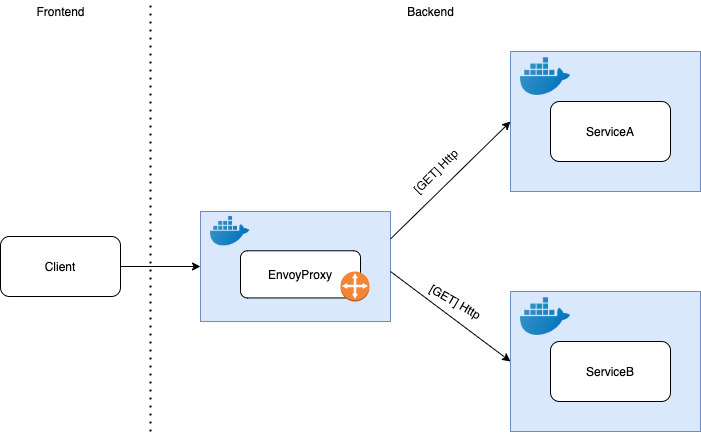
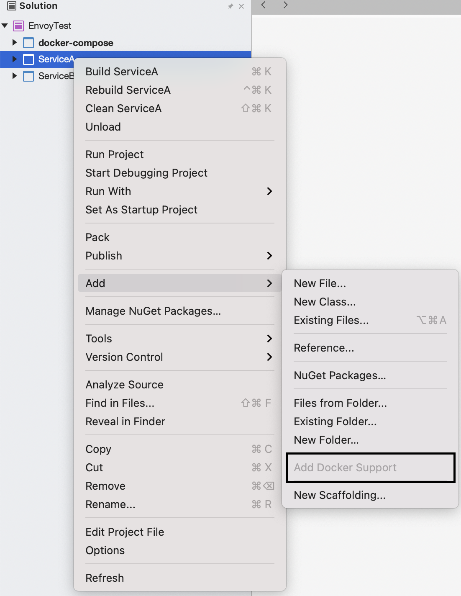
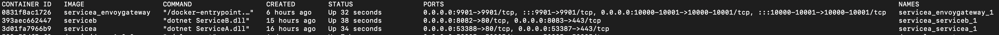

# EnvoyProxy as an API Gateway

This tutorial will show the steps to implement a basic API gateway using Envoy and dockerized services. 



The image above illustrates the components involved in the project structure as well as the communication between Envoy node and both services.

## Prerequisites

This solution requires you to have the following componentes in your machine:

- [Docker](https://www.docker.com/get-started)
- [.NETCORE](https://docs.microsoft.com/en-us/dotnet/)
- [Visual Studio](https://visualstudio.microsoft.com/es/) [Recommended]

## Optional
- [Postman](https://www.getpostman.com/) || [Thunder Client for VSCode](https://marketplace.visualstudio.com/items?itemName=rangav.vscode-thunder-client) 
- [Docker extension for VSCode](https://marketplace.visualstudio.com/items?itemName=ms-azuretools.vscode-docker)  

## Step 1 - Create basic containers with the services

The services are build on .NetCore and every of them has it own controller that return a simple Ok() response denoting what is the service. 
The first thing you need is to create basic containers for both services.

### Service A - Controller

```cs
using System;
using System.Collections.Generic;
using System.Linq;
using System.Threading.Tasks;
using Microsoft.AspNetCore.Mvc;
using Microsoft.Extensions.Logging;

namespace ServiceA.Controllers
{
    [ApiController]
    [Route("[controller]")]
    public class ServiceAController : ControllerBase
    {
        
        [HttpGet]
        public ActionResult Get()
        {
            return Ok("Service A");
        }
    }
}

```

### Service B - Controller

```cs
using System;
using System.Collections.Generic;
using System.Linq;
using System.Threading.Tasks;
using Microsoft.AspNetCore.Mvc;
using Microsoft.Extensions.Logging;

namespace ServiceA.Controllers
{
    [ApiController]
    [Route("[controller]")]
    public class ServiceAController : ControllerBase
    {
        
        [HttpGet]
        public ActionResult Get()
        {
            return Ok("Service A");
        }
    }
}

```

## Making service a container

If you are using Visual Studio you can just press right click on the service (Service A & Service B), then, click on 'Add' and finally 'Add Docker Support'. It will automatically get the required files to make that service a docker. 



> **Note**: Check if the docker-compose folder has been created before you run the above option.

In the case you wanted to create the dockers using the CLI, check the following documentation about docker building:
[Build the app’s container image](https://docs.docker.com/get-started/02_our_app/)

## Step 2 - Create the Envoy container

This is the most important container in our solution because here we will configure the API Gateway for routing between services.

Inside the Envoy folder you will find a Dockerfile which has the Envoy image import in 1.14.1 version. 

```yaml
#Envoy image import
FROM envoyproxy/envoy:v1.14.1
```

### Envoy setup in YAML file
```yaml
admin:
  access_log_path: /tmp/admin_access.log
  address:
    socket_address:
      protocol: TCP
      address: 0.0.0.0
      port_value: 9901
static_resources:
  listeners:
  - name: listener_0
    address:
      socket_address:
        protocol: TCP
        address: 0.0.0.0
        port_value: 10000
    filter_chains:
    - filters:
      - name: envoy.filters.network.http_connection_manager
        typed_config:
          "@type": type.googleapis.com/envoy.config.filter.network.http_connection_manager.v2.HttpConnectionManager
          stat_prefix: ingress_http
          route_config:
            name: local_route
            virtual_hosts:
            - name: local_service
              domains: ["*"]
              routes:
              - match:
                  prefix: "/a"
                route:
                  prefix_rewrite: "/servicea"
                  cluster: service_a
              - match:
                  prefix: "/b"
                route:
                  prefix_rewrite: "/serviceb"
                  cluster: service_b
          http_filters:
          - name: envoy.filters.http.router   
  clusters:
  - name: service_a
    connect_timeout: 0.25s
    type: LOGICAL_DNS
    dns_lookup_family: V4_ONLY
    lb_policy: ROUND_ROBIN
    load_assignment:
      cluster_name: service_a
      endpoints:
      - lb_endpoints:
        - endpoint:
            address:
              socket_address:
                address: servicea #docker-compose.yml service name
                port_value: 80
    #This cluster is ready for https connection. Listener is missing            
  - name: secure_service_a
    connect_timeout: 0.25s
    type: LOGICAL_DNS
    dns_lookup_family: V4_ONLY
    lb_policy: ROUND_ROBIN
    load_assignment:
      cluster_name: secure_service_a
      endpoints:
      - lb_endpoints:
        - endpoint:
            address:
              socket_address:
                address: servicea #docker-compose.yml service name
                port_value: 443
    transport_socket:
      name: envoy.transport_sockets.tls
      typed_config:
        "@type": type.googleapis.com/envoy.extensions.transport_sockets.tls.v3.UpstreamTlsContext
        sni: localhost            
  - name: service_b
    connect_timeout: 0.25s
    type: LOGICAL_DNS
    dns_lookup_family: V4_ONLY
    lb_policy: ROUND_ROBIN
    load_assignment:
      cluster_name: service_b
      endpoints:
      - lb_endpoints:
        - endpoint:
            address:
              socket_address:
                address: serviceb #docker-compose.yml service name
                port_value: 80
```
> **Note**: The Envoy's YAML file was taken from the official [Envoy page](https://www.envoyproxy.io/docs/envoy/latest/start/quick-start/configuration-static) but has some changes to ensure the connections with the ports specified in the docker-compose file.

## Step 3 - Compose the dockers

In this step the containers are going to be composed to deploy just 1 solution with the 3 services (A, B and EnvoyProxy).

```sh
docker-compose up --build
```
Warning: keep the terminal alive because the container are running on it.

To check the containers status execute:
```sh
docker ps
```

The output should look like:


## Step 4 - Testing Envoy with browser

As this project is running on a local environment, just need to run in your browser with http protocol, localhost as ip in the 10000 port. Test them here: 
- Service A (http://localhost:10000/a)
- Service B (http://localhost:10000/b)

## Extra advice
The following Youtube link will help you to understand the complete solution with an example. 
(https://youtu.be/UsoH5cqE1OA)

